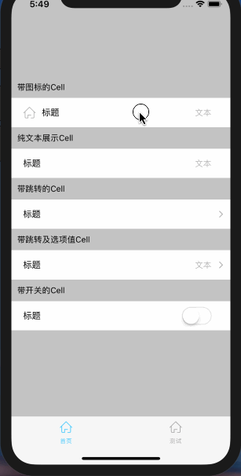

# react-native-setting-cell

封装了一个react-native的组件，类似设置页面的设置项或者个人信息里的信息项，通过传参的变化，灵活生成对应的样式，方便开发。



### 安装

安装npm依赖

```
npm install react-native-setting-cell --save
```

### 使用

在文件中引入setting-cell

```
import SettingCell from 'react-native-setting-cell'
```

* 纯文本的Cell

```
<SettingCell text='标题' subText='文本'/>
```

* 带图标的Cell

```
<SettingCell text='标题' icon={require('./icon/home.png')}/>
```

* 带跳转的的Cell

```
<SettingCell text='标题' onPress={()=>{alert(1)}}/>
```

* 带开关的Cell

```
<SettingCell text='标题' mode='Switch' onChange={(val) => {alert(val)}}/>
```

* 修改文本的样式

```
<SettingCell text='标题' textStyle={{color:'#baba00', fontSize:20}} subText='文本' subTextStyle={{fontSize:16, color:'#000'}}/>
```

* 修改图标的样式

```
<SettingCell text='标题' icon={require('./icon/home.png')} iconStyle={{width:100}}/>
```

### 属性

| 名称 | 类型 | 说明 |
| -----|:----:| ----:|
| text    | String    | 左侧文字    |
| textStyle    | Object    |   左侧文字的样式  |
| icon    | Number    |   图标的图片地址  |
| iconStyle    | Object    |   图标的样式  |
| mode    | String    |  Text 或者 Switch   |
| subText    | String    |  右侧文字   |
| subTextStyle    | Object    |   右侧文字的样式  |
| switchValue    | Bool    |   Switch的状态,默认为false  |
| onPress    | Function    |   Cell点击后的事件  |
| onChange    | Function    |   Switch切换后的事件  |

### Todo

* ~~增加各个组件的样式修改~~
